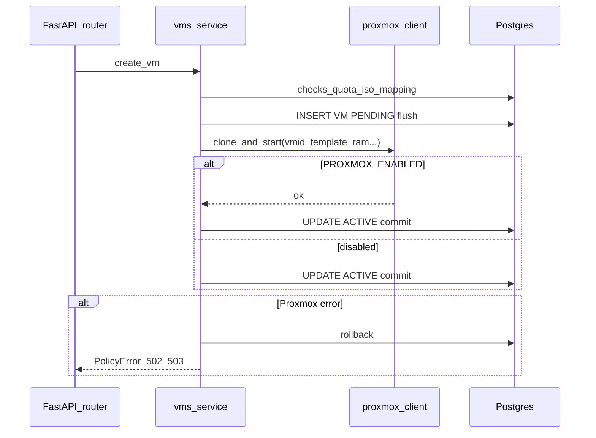

# Plan — Intégration Proxmox (avec tables de correspondance)

## Décisions figées (tes réponses)

- **ISO ↔ template** : **table de correspondance** (pas de colonne sur `iso_images` seule).
- **Sans Proxmox** : `PROXMOX_ENABLED=false` → **aucun appel** `proxmoxer`, comportement **identique à aujourd’hui** (VM créée et passée `ACTIVE` en base comme dans [horizon/features/vms/service.py](horizon/features/vms/service.py)).
- **Échec à la création** : **une transaction** — pas de commit tant que Proxmox n’a pas réussi (rollback session si exception après les checks métier).
- **REM / RAM / EMILIA** : **table de mapping** `PhysicalNode` (enum) → nom de nœud Proxmox (`str`).
- **DELETE VM** : appeler Proxmox pour **détruire** la VM (suppression réelle côté cluster), puis cohérence BDD.
- **Bonus promoxer** (pause, liste QEMU nœud, status current) : exposés sous `**/api/v1/admin/...`** avec schémas Pydantic.

---

## 1. Dépendances et configuration

- Ajouter dans [requirements.txt](requirements.txt) : `proxmoxer` (version épinglée compatible Python 3.11), réutiliser `urllib3` déjà transitif ou explicite si besoin.
- Étendre [horizon/core/config.py](horizon/core/config.py) (`Settings`) avec :
  - `PROXMOX_ENABLED: bool = False`
  - `PROXMOX_HOST`, `PROXMOX_USER`, `PROXMOX_TOKEN_ID`, `PROXMOX_TOKEN_SECRET`, `PROXMOX_VERIFY_SSL: bool = False`
  - (Pas de `PROXMOX_NODE` unique obligatoire si tout passe par la table de nœuds ; **fallback** `PROXMOX_DEFAULT_NODE` si une ligne de mapping manque — à documenter dans `.env.example`.)
- Mettre à jour [.env.example](.env.example) avec toutes les variables + commentaire sur `PROXMOX_ENABLED`.

---

## 2. Schéma SQL — deux nouvelles tables (Alembic)

**Fichier** : nouvelle révision dans [horizon/infrastructure/migrations/versions/](horizon/infrastructure/migrations/versions/) (après `0001`).

### Table A — `iso_proxmox_templates` (correspondance ISO ↔ template)

| Colonne                     | Type        | Contraintes                                                     |
| --------------------------- | ----------- | --------------------------------------------------------------- |
| `id`                        | UUID        | PK                                                              |
| `iso_image_id`              | UUID        | FK `iso_images.id`, **unique** (1 template par ISO pour le MVP) |
| `proxmox_template_vmid`     | Integer     | NOT NULL                                                        |
| `created_at` / `updated_at` | timestamptz | comme le reste du schéma                                        |

- Relation ORM : `ISOImage` → `iso_proxmox_template` (uselist=False) ou accès via query dans le service.

### Table B — `proxmox_node_mappings` (REM/RAM/EMILIA → nom Proxmox)

| Colonne             | Type                                          | Contraintes                              |
| ------------------- | --------------------------------------------- | ---------------------------------------- |
| `id`                | UUID                                          | PK                                       |
| `physical_node`     | enum aligné sur `physical_node_enum` existant | **unique** (une ligne par valeur d’enum) |
| `proxmox_node_name` | String(64)                                    | NOT NULL                                 |

- Seed / migration de données : insérer les 3 lignes avec des **placeholders** ou valeurs d’exemple documentées (l’admin les ajuste en prod).

### Modèles SQLAlchemy

- Nouveau fichier dédié (ex. [horizon/shared/models/proxmox_mapping.py](horizon/shared/models/proxmox_mapping.py)) ou extension d’un module existant **sans** modifier les colonnes de `ISOImage` pour le lien template (uniquement relation / table séparée).
- Exporter les modèles dans [horizon/shared/models/**init**.py](horizon/shared/models/__init__.py) pour Alembic `Base.metadata`.

---

## 3. Client Proxmox (`infrastructure`)

- Créer [horizon/infrastructure/proxmox_client.py](horizon/infrastructure/proxmox_client.py) en reprenant la logique de [horizon_backend_promoxer/proxmox_service.py](horizon_backend_promoxer/proxmox_service.py) :
  - Classe unique (ex. `ProxmoxClient`) : `create_vm_from_template`, `start_vm`, `stop_vm`, `delete_vm` (API Proxmox destroy), `pause_vm`, `list_node_qemu`, `get_vm_current_status`.
  - `__init__` : si `not settings.PROXMOX_ENABLED`, **ne pas** instancier `ProxmoxAPI` (ou lazy no-op) pour éviter erreurs de config en dev.
  - Désactivation des warnings SSL comme dans le code source quand `VERIFY_SSL` est faux.
- **Paramètre `node: str`** passé explicitement à chaque appel (résolu via `proxmox_node_mappings` + `VirtualMachine.node`).

Fonctions pures / levées d’exceptions : encapsuler les erreurs `proxmoxer`/HTTP en une exception interne (ex. `ProxmoxIntegrationError`) convertie en `PolicyError` ou `HTTPException` dans le service métier avec code **502/503** selon le cas (à figer dans le plan d’implémentation : préférer `PolicyError` avec détail masqué en prod si besoin).

---

## 4. Refactor `create_vm` — transaction unique

Fichier principal : [horizon/features/vms/service.py](horizon/features/vms/service.py).

**Comportement actuel à préserver quand `PROXMOX_ENABLED=false`** : même ordre de checks (ISO, quotas, `_select_node`, `_next_proxmox_vmid`, réservation, audit) puis `ACTIVE` — **sans** appel réseau.

**Comportement quand `PROXMOX_ENABLED=true`** :

1. Vérifier qu’il existe une ligne dans `iso_proxmox_templates` pour `iso.id` ; sinon `PolicyError` **404/409** explicite (ex. « ISO non provisionnée sur Proxmox »).
2. Résoudre `proxmox_node_name` depuis `proxmox_node_mappings` pour `PhysicalNode` choisi ; sinon erreur config.
3. Créer l’objet `VirtualMachine` avec statut `**PENDING`** (ajustement par rapport au flux actuel qui commit puis force `ACTIVE` en deux temps).
4. `db.add` réservation + VM + `log_action` VM_CREATED (ou log après succès Proxmox — **à choisir pour cohérence audit** : recommandation — log après succès Proxmox pour éviter audits orphelins ; si log avant, rollback supprime la transaction entière y compris log selon modèle).
5. `**db.flush()`** pour obtenir `proxmox_vmid` / id internes cohérents.
6. Appeler `ProxmoxClient.create_vm_from_template(...)` avec :

- `new_vmid=vm.proxmox_vmid`
- `memory` = `ram_gb` → Mo (entier)
- `cores` = `vcpu`
- `net0` : construire depuis [horizon/core/config.py](horizon/core/config.py) **template** du type `virtio,bridge=vmbr0,tag={vlan_id}` si `vlan_id` présent, sinon défaut configurable (`PROXMOX_NET0_TEMPLATE` ou constante documentée).

1. Succès → `vm.status = ACTIVE`, `db.commit()`.
2. Échec → `db.rollback()`, propager erreur métier.

**Point d’attention** : le code actuel fait **deux `commit`** et passe à `ACTIVE` dans le même module — à **fusionner** en un flux à commit unique (ou rollback explicite sur exception).

---

## 5. `stop_vm`, `delete_vm`, et alignement Proxmox

- `**stop_vm`** : si `PROXMOX_ENABLED`, appeler `stop_vm` Proxmox sur `(proxmox_node_name, proxmox_vmid)` **avant** ou **après** mise à jour BDD — recommandation : **Proxmox d’abord**, puis BDD ; si Proxmox échec, ne pas marquer STOPPED (éviter divergence).
- `**delete_vm`** : si `PROXMOX_ENABLED`, **destroy** sur Proxmox puis `db.delete` ; si échec Proxmox, erreur HTTP et **pas** de suppression BDD.
- `**update_vm`** (CPU/RAM/disque) : **hors scope minimal** sauf mention dans le README : aujourd’hui seulement BDD ; phase 2 = `config.post` Proxmox si besoin.

---

## 6. Feature `admin` — routes bonus + gestion des mappings (minimal)

- Nouveaux schémas dans [horizon/features/admin/schemas.py](horizon/features/admin/schemas.py) pour :
  - Réponses liste QEMU / status / pause (wrappers typés, pas de JSON nu).
- Nouveaux endpoints dans [horizon/features/admin/router.py](horizon/features/admin/router.py) (préfixe existant `/admin`) :
  - `POST .../proxmox/vms/{vmid}/pause` (vmid = Proxmox VMID ou id Horizon ? **Décision** : utiliser `**proxmox_vmid`** en path pour coller au cluster, avec vérif admin ; documenter dans OpenAPI).
  - `GET .../proxmox/node/{node_name}/qemu` — liste brute (avec `node_name` = nom Proxmox autorisé ou issu d’un enum résolu).
  - `GET .../proxmox/vms/{vmid}/status` — `current.get()`.

**CRUD minimal des tables de mapping** (pour ne pas éditer la BDD à la main) :

- `GET/POST/PATCH` (ou PUT) pour `proxmox_node_mappings` et `iso_proxmox_templates` réservés **ADMIN** — schémas dédiés dans `admin/schemas.py`.

---

## 7. Seed et documentation

- [scripts/seed.py](scripts/seed.py) : après création des `ISOImage`, insérer des lignes **exemple** dans `iso_proxmox_templates` (vmid fictifs **documentés** comme à remplacer) et remplir `proxmox_node_mappings` pour REM/RAM/EMILIA avec des noms type `pve-1` si besoin.
- [README.md](README.md) : section Proxmox (variables, ordre migrate + seed, `PROXMOX_ENABLED`).

---

## 8. Tests

- **Unit** : client Proxmox mocké (`PROXMOX_ENABLED=true` + patch `ProxmoxAPI`) pour `create_vm` rollback sur exception.
- **Intégration** : avec `PROXMOX_ENABLED=false`, la suite actuelle **doit rester verte** sans Testcontainers Proxmox.
- Ajouter tests ciblés : création avec `ENABLED=false` inchangée ; avec `ENABLED=true` + mock, succès commit unique ; mapping ISO manquant → 4xx.

---

## 9. Nettoyage

- Supprimer le dossier [horizon_backend_promoxer/](horizon_backend_promoxer/) (y compris `.git` interne — **ne pas** fusionner ce dépôt dans le projet principal ; vérifier qu’aucun chemin CI ne le référence).
- `grep` final : plus de références à `horizon_backend_promoxer`.

---

## Risques / suivis (hors scope immédiat)

- **Clone asynchrone** : l’API Proxmox peut renvoyer avant la fin du clone ; si problèmes en prod, ajouter tâche APScheduler de **reconciliation** (statut Proxmox vs BDD).
- **Multi-cluster** : les tokens actuels sont globaux ; la table de nœuds suffit pour un seul cluster multi-nœuds.
